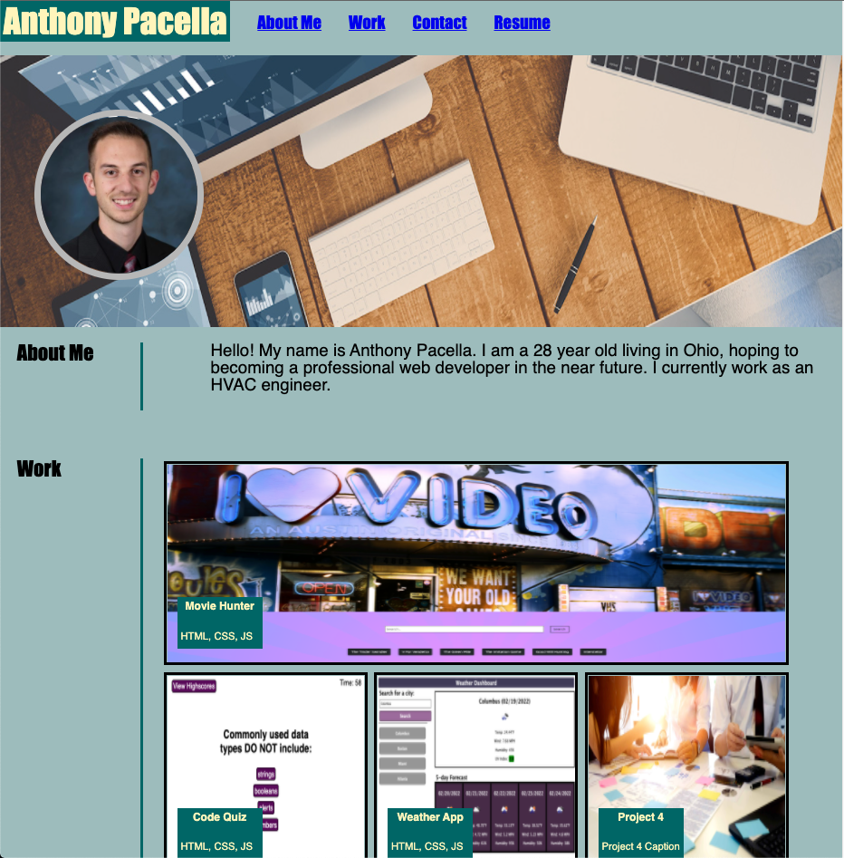

# Developer Portfolio

## User Story

* As an web developer with projects to showcase, I want to have a page to display the projects I have worked on
* As a prospective web developer, I want to have my contact information along side of my projects so that a prospective employer can get in touch with me.

## Features

* Header link - About Me, Work, Contact references to the web page. Resume link that will download the developer's resume.
* Developer photo
* About Me - A brief description of the developer
* Work - The developer's four best projects. Each photo is clickable and will take the user to the GitHub repository for the project.
* Contact - Developer's contact information, including email address, LinkedIn profile, and Github profile.

## Languages
* HTML
* CSS

## Mock-Up

## Links
* GitHub Repository: https://github.com/anthonypacella/ProfessionalPortfolio
* Deployed Page: https://anthonypacella.github.io/ProfessionalPortfolio/